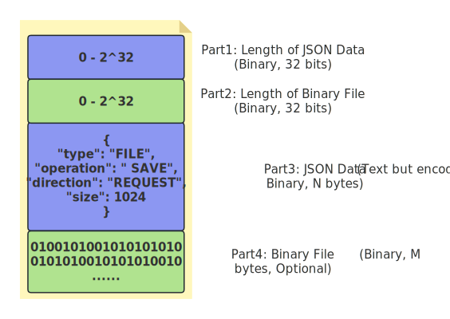
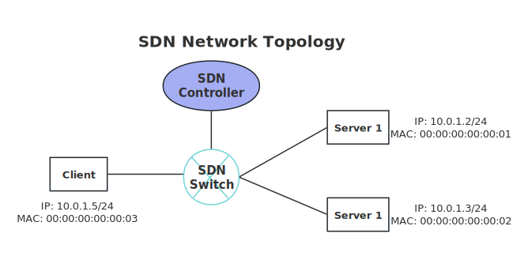

# Computer Networking Projects

1. [Introduction](#introduction)
2. [File Transfer Application](#file-transfer-application)
    - [Protocol Specification](#protocol-specification)
    - [Requirements](#requirements)
    - [Usage](#usage)
    - [Document](#document)
4. [SDN-based Network Traffic Control](#sdn-based-network-traffic-control)
    - [Requirements](#requirements)
    - [Document](#document)
5. [Contributors](#contributors)

## Introduction

The repository consists of two different projects: **File Transfer Application** and **SDN-based Network Traffic Control**. The repo houses the codes for both projects, each residing in its respective folder named **file_transfer** and **network_traffic_control**. 

## File Transfer Application

The project aims to utilize Python socket programming to implement a client-side application for file uploading, adhering to a custom application-layer protocol.    
> **Note**: The protocol specification and the server-side application have been defined and provided by a university professor.

### Protocol Specification

STEP (Simple Transfer and Exchange Protocol) is a stateless, client-server, TCP-based protocol for data and file exchange. It uses JSON as the data representation format for simplicity. STEP servers provide services for uploading, storing, downloading, and deleting data and files. Clients need authorization to access and manage both public and private data on the server. By default, the server listens on port 1379. The connection established between the client and server remains active until the client decides to close it. STEP clients initiate connections to send one or more continuous requests, while the STEP server accepts incoming connections and responds with corresponding responses. Both requests and responses in STEP messages share the same format, including fields such as "Operation", "Direction", and other specific fields.

**STEP Message Format**:  
The figure and table below clarify the message format:

  

| Part                                                     | Length (Bytes) | Description                                                                                | 
|--------------------------------------------------------- |:--------------:|--------------------------------------------------------------------------------------------|
| Length of JSON Data (Compulsory, Binary, unsigned int)   | 4              | Represent the length of JSON Data (N), allowing for a maximum length of 2^32 bytes         | 
| Length of Binary Data (Compulsory, Binary, unsigned int) | 4              | Represent the length of Binary File Data (M), allowing for a maximum length of 2^32 bytes  |
| JSON Data (Compulsory, Text but encoded to Binary)       | N              | JSON data which should be decoded and parsed according to JSON rules                       |
| Binary File Data (Optional, Binary)                      | M              | Binary file data, file or block                                                            |

**Reserved Fields of JSON Data**:  

> **Note**: The operations related to data (e.g., SAVE, DELETE, and GET for data) are not relevant to this project though it is well-defined in the protocol, as the primary objective is to implement a client-side application for file uploading.

1. **type**: Specifies the type of data transfer, which can be **AUTH**, **DATA**, **FILE**.
2. **operation**: Defines the operation to be performed, which can be **SAVE**, **DELETE**, **GET**, **UPLOAD**, **DOWNLOAD**, **BYE**, **LOGIN**.
   - For **authorization**, operation can be LOGIN.
     - "type" field must be AUTH, and include "username" (your ID as a string) and "password" (MD5 hash of your ID) fields. The response will include a "token."
   - For **DATA**, operations can be SAVE, DELETE, and GET.
     - SAVE: Save data, with an optional "key" field. The server will reply with the key or generate one if not provided.
     - GET: Retrieve data using a specified key.
     - DELETE: Delete data using a key.
   - For **FILE**, operations can be SAVE, DELETE, GET, UPLOAD, and DOWNLOAD.
     - SAVE: Start a file storage request with a "key" and "size" of the file. The key can be defined by the client or generated by the server if not provided. The server responds with the file upload plan.
     - DELETE: Delete a file by its key.
     - GET: Initiate a file download request by key, and the server responds with the file download plan.
     - UPLOAD: Upload a file block or the entire file using the "key" and "block_index." The server sends the MD5 checksum when it receives the complete file.
     - DOWNLOAD: Download a file block or the entire file using the "key" and "block_index."
3. **direction**: Specifies the direction of communication, which can be REQUEST or RESPONSE.
4. **status**: Indicates the status of the request, with values of 200 for success and 400+ for errors.
   - Successful status codes:
     - 200: OK
   - Error status codes:
     - 400: Compulsory field is missing.
     - 401: Password error for login.
     - 402: The key already exists.
     - 403: No token or an incorrect token.
     - 404: Key not found.
     - 405: Block index exceeds the maximum block number.
     - 406: Uploaded size doesn't match the required block size.
     - 407: Incorrect direction.
     - 408: Incorrect operation.
     - 409: Type is not allowed.
     - 410: Field is missing.
5. **md5**: Contains MD5 hash value of the file.
6. **size**: Represents file size or block size, ranging from 1 to 4,294,967,296.
7. **block_index**: Indicates the block index (0 to N-1, where N is the total block number).
8. **block_size**: Specifies the block size, ranging from 1 to 65,536.
9. **total_block**: Indicates the total block number for uploading or downloading.
10. **key**: A string field that can be a custom key or generated by the server.
11. **token**: A string obtained during the authorization process.

### Requirements
- Python>=3.6

### Usage
...

### Document
For more detailed info, please [click](./file_transfer/Report/Report-PartI.pdf) to read the report for this project.

## SDN-based Network Traffic Control

The project utilizes [Mininet](https://github.com/mininet/mininet), a powerful tool for emulating SDN (Software Defined Network), to construct a simple SDN network topology (see the following figure) and simulate traffic control within the Mininet-emulated environment. The primary objective is to develop two different SDN controller applications using [Ryu](https://github.com/faucetsdn/ryu) framework to implement traffic forwarding and redirection, respectively. The controller application that implements traffic forwarding directly forwards network traffic from Client to Server 1, while the other one redirects the traffic to Server 2 without the awareness of Client.

### Requirements
...

### Document
For more detailed info, please [click](./network_traffic_control/Report/Report_PartII.pdf) to read the report for this project.

## Contributors

- [Yuzhen Chen](https://github.com/kdpkst)
- [Bowen Li](https://github.com/refugee123456)
- [Yizhen Cao](https://github.com/tinshien-Young)
